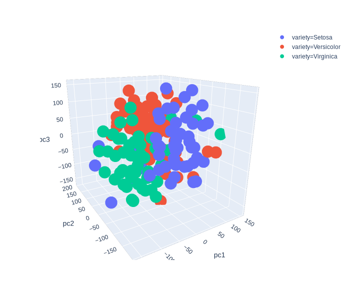

### Dimensionality Reduction

Basic repository implemented with,

- PCA
- T-SNE


#### Run Command

```
python dim_reduction.py conf.json
```

##### Configuration

configure your changes in **conf.json**

Example :

```
{
  "data": "iris.csv",
  "columns": [
    "sepal.length",
    "sepal.width",
    "petal.length",
    "petal.width"
  ],
  "label": "variety",
  "method": "tsne",
  "output_csv": "out.csv"
}
``` 


#### Output

- `out.csv` dimensionality reduced file
- Plotly output in HTML **3D Plot** 


